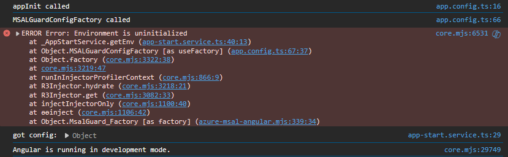

# MsalTest

This is a project that demonstrates that the `MSAL_GUARD_CONFIG` factory is called before the `APP_INITIALIZER` promise is resolved.

[From Angular's documentation](https://angular.io/api/core/APP_INITIALIZER)
> The provided functions are injected at application startup and executed during app initialization. If any of these functions returns a Promise or an Observable, initialization does not complete until the Promise is resolved or the Observable is completed.

## Steps to reproduce
1. Install the dependencies with `npm i`
2. Start the application with `npm start`
3. Open http://localhost:4200 in a browser.

### Expected Results
1. The `APP_INITIALIZER` is invoked and the promise is resolved.
2. The `MSAL_GUARD_CONFIG` factory is invoked (along with the other *MSAL* components)
3. The application loads successfully in the browser.

### Actual Results
1. The `APP_INITIALIZER` is invoked, but the `Promise` has not resolved.
2. The `MSAL_GUARD_CONFIG` factory is invoked.
3. An Error is thrown because the startup config values are unavailable because the `APP_INITIALIZER` promise hasn't yet resolved.
4. The `APP_INITIAIZER` promise is resolved, and the config values are ready.
5. The application does not load in the browser due to the previous error.

## Notes
1. This only appears to be an issue when the default route is protected with `canActivate: [MsalGuard]`.
2. If the default route is not protected, the application loads as expected.
